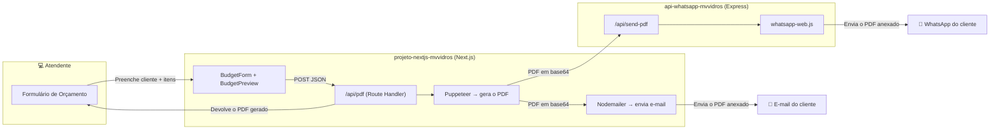

<div align="center">

# 🪟 Sistema MV Vidros

### Geração automática de orçamentos com envio por E-mail e WhatsApp

[](https://nextjs.org/)
[](https://react.dev/)
[](https://www.typescriptlang.org/)
[](https://nodejs.org/)
[](https://expressjs.com/)
[](https://wwebjs.dev/)
[](https://tailwindcss.com/)
[](https://www.docker.com/)

</div>

---

## 📖 Sobre o projeto

O **Sistema MV Vidros** é uma aplicação full‑stack desenvolvida para automatizar a criação e o envio de **orçamentos comerciais** de uma vidraçaria. Em vez de montar o orçamento manualmente em algum editor de texto, o atendente preenche um formulário simples com os dados do cliente e os itens do serviço (vidros, alumínio, ferragens, mão de obra etc.), visualiza uma prévia fiel ao documento final e, com um clique, o sistema:

1. 🧾 Gera um **PDF profissional** do orçamento (via Puppeteer);
2. 📧 Envia esse PDF automaticamente por **e-mail** para o cliente (via Nodemailer);
3. 📱 Envia o mesmo PDF diretamente no **WhatsApp** do cliente (via um bot baseado em `whatsapp-web.js`).

O projeto é um **monorepo** dividido em dois serviços independentes, orquestrados por Docker Compose, que conversam entre si através de uma API HTTP interna.

---

## 🧭 Como funciona (fluxo geral)



Em resumo: o **frontend** monta o documento e dispara os dois canais de envio; o **bot de WhatsApp** é apenas um microsserviço dedicado a manter a sessão do WhatsApp Web aberta e disparar mensagens quando solicitado pela API interna.

---

## ✨ Funcionalidades

- 📋 **Formulário dinâmico** de orçamento com validação (React Hook Form + Zod)
  - Dados do cliente: nome, endereço, telefone e e-mail (opcional)
  - Lista de itens com adição/remoção dinâmica (`useFieldArray`)
  - Categorias de produto: `Vidro`, `Alumínio`, `Mão de Obra`, `Ferragem`
- 👀 **Tela de prévia** do orçamento, idêntica ao layout do PDF final, com cálculo automático do valor total
- 🧾 **Geração de PDF server-side** com Puppeteer, a partir de um template HTML/Tailwind
- 📧 **Envio automático por e-mail** com o PDF em anexo (Gmail SMTP via Nodemailer)
- 📱 **Envio automático por WhatsApp** com o PDF em anexo, incluindo:
  - Normalização automática de números de telefone brasileiros (adiciona DDD/DDI quando necessário)
  - Autenticação persistente via QR Code (sessão salva em volume Docker)
- 🐳 **Containerização completa** dos dois serviços com Docker Compose
- 🔒 Separação de segredos via variáveis de ambiente (`.env`)

---

## 🗂️ Estrutura do repositório

```
Sistema-MvVidros/
├── docker-compose.yml              # Orquestra os dois serviços (frontend + bot)
├── .env                            # Variáveis de ambiente (EMAIL_USER, EMAIL_PASS...)
│
├── projeto-nextjs-mvvidros/        # 🖥️  Frontend + API de geração de orçamento
│   ├── app/
│   │   ├── page.tsx                 # Página inicial (renderiza o BudgetForm)
│   │   ├── layout.tsx                # Layout raiz (fontes, metadados)
│   │   └── api/
│   │       └── pdf/route.ts          # Endpoint POST /api/pdf (gera PDF + dispara envios)
│   ├── components/
│   │   ├── BudgetForm.tsx            # Formulário de criação do orçamento
│   │   └── BudgetPreview.tsx         # Prévia visual do orçamento antes de gerar o PDF
│   ├── lib/
│   │   ├── pdfTemplate.ts            # Template HTML usado pelo Puppeteer
│   │   ├── mailer.ts                 # Envio de e-mail (Nodemailer)
│   │   ├── wppSender.ts              # Chamada HTTP para o bot de WhatsApp
│   │   └── formatter.ts              # Formatação de telefone (padrão BR)
│   ├── types/
│   │   ├── schema.ts                 # Schema Zod de validação do orçamento
│   │   └── budgetPreviewProps.ts     # Tipagem das props do componente de prévia
│   ├── Dockerfile
│   └── package.json
│
└── api-whatsapp-mvvidros/          # 🤖 Bot de WhatsApp (microsserviço)
    ├── index.js                     # Servidor Express + cliente whatsapp-web.js
    ├── Dockerfile
    └── package.json
```

---

## 🛠️ Tecnologias utilizadas

### Frontend / API de orçamentos (`projeto-nextjs-mvvidros`)

| Categoria        | Tecnologia                                                        |
| ---------------- | ------------------------------------------------------------------ |
| Framework        | [Next.js 16](https://nextjs.org/) (App Router) + [React 19](https://react.dev/) |
| Linguagem        | TypeScript                                                          |
| Estilização      | Tailwind CSS 4                                                      |
| Formulários      | React Hook Form + `@hookform/resolvers`                             |
| Validação        | Zod                                                                  |
| Geração de PDF   | Puppeteer (renderiza HTML → PDF no servidor)                        |
| Envio de e-mail  | Nodemailer (SMTP do Gmail)                                          |

### Bot de WhatsApp (`api-whatsapp-mvvidros`)

| Categoria        | Tecnologia                                                        |
| ---------------- | ------------------------------------------------------------------ |
| Runtime          | Node.js                                                              |
| Servidor HTTP    | Express 5                                                            |
| Integração WhatsApp | [`whatsapp-web.js`](https://wwebjs.dev/) (usa Puppeteer/Chromium internamente) |
| Autenticação     | `LocalAuth` (sessão persistida em disco) + `qrcode-terminal` para o QR Code |
| CORS             | `cors`                                                               |

### Infraestrutura

- **Docker** + **Docker Compose** para orquestrar os dois serviços como containers independentes que se comunicam pela rede interna do Compose.

---

## ✅ Pré-requisitos

- [Docker](https://docs.docker.com/get-docker/) e [Docker Compose](https://docs.docker.com/compose/) (recomendado), **ou**
- [Node.js](https://nodejs.org/) 18+ e npm, caso prefira rodar os serviços manualmente
- Uma conta do **Gmail** com [senha de app](https://support.google.com/accounts/answer/185833) gerada (necessária para o envio de e-mail via SMTP)
- Um número de **WhatsApp** dedicado para autenticar o bot (recomendado não usar seu WhatsApp pessoal — veja o aviso mais abaixo)

---

## ⚙️ Configuração

### 1. Clone o repositório

```bash
git clone https://github.com/CarlosZeyy/Sistema-MvVidros.git
cd Sistema-MvVidros
```

### 2. Configure as variáveis de ambiente

Edite o arquivo `.env` na raiz do projeto com as credenciais do Gmail que enviará os orçamentos:

```env
EMAIL_USER=seu-email@gmail.com
EMAIL_PASS=sua-senha-de-app-do-gmail
```

| Variável            | Onde é usada                              | Descrição                                                                 |
| -------------------- | ------------------------------------------ | --------------------------------------------------------------------------- |
| `EMAIL_USER`         | `projeto-nextjs-mvvidros` (`lib/mailer.ts`) | E-mail remetente usado para enviar o PDF do orçamento                       |
| `EMAIL_PASS`         | `projeto-nextjs-mvvidros` (`lib/mailer.ts`) | Senha de app do Gmail (não use a senha normal da conta)                     |
| `WHATSAPP_API_URL`   | `projeto-nextjs-mvvidros` (`lib/wppSender.ts`) | Já definida no `docker-compose.yml` apontando para o serviço `whatsapp-bot` |

> ⚠️ **Nunca** faça commit de um `.env` com credenciais reais. Adicione esse arquivo ao `.gitignore` em ambientes de produção.

---

## 🚀 Executando com Docker (recomendado)

Com o `.env` configurado, basta subir os containers:

```bash
docker compose up --build
```

Isso vai construir e iniciar dois containers:

| Serviço          | Container             | Porta  | Descrição                                   |
| ----------------- | ---------------------- | ------ | --------------------------------------------- |
| `frontend-app`     | `mvvidros-frontend`     | `3000` | Aplicação Next.js (formulário + geração de PDF) |
| `whatsapp-bot`     | `mvvidros-bot`          | `3001` | API interna que envia os orçamentos via WhatsApp |

### Autenticando o WhatsApp

Na **primeira execução**, o container `whatsapp-bot` vai imprimir um **QR Code no terminal** (`docker compose logs -f whatsapp-bot`). Escaneie esse QR Code com o WhatsApp do número que enviará os orçamentos (em **Aparelhos conectados** no app do WhatsApp). A sessão é persistida no volume `wwebjs_auth`, então não será necessário escanear novamente nas próximas inicializações, a menos que a sessão seja invalidada.

Quando o bot estiver pronto, você verá no log:

```
O Robô da MV Vidros está online!
```

Depois disso, acesse **http://localhost:3000** para usar o sistema.

> 💡 O volume `wwebjs_auth` é declarado como `external: true` no `docker-compose.yml`. Caso ele ainda não exista no seu Docker, crie-o antes de subir os containers:
> ```bash
> docker volume create wwebjs_auth
> ```

---

## 🖥️ Executando manualmente (sem Docker)

Caso prefira rodar os dois serviços localmente, em dois terminais separados:

**Terminal 1 — Bot de WhatsApp**

```bash
cd api-whatsapp-mvvidros
npm install
node index.js
```

Escaneie o QR Code exibido no terminal.

**Terminal 2 — Frontend**

```bash
cd projeto-nextjs-mvvidros
npm install
```

Configure um arquivo `.env.local` (ou exporte as variáveis no shell) com:

```env
EMAIL_USER=seu-email@gmail.com
EMAIL_PASS=sua-senha-de-app
WHATSAPP_API_URL=http://localhost:3001/api/send-pdf
```

E então:

```bash
npm run dev
```

Acesse **http://localhost:3000**.

---

## 🧑‍💻 Usando o sistema

1. Acesse a aplicação em `http://localhost:3000`.
2. Preencha os **dados do cliente** (nome, endereço, telefone e, opcionalmente, e-mail).
3. Clique em **"+ Adicionar Produto"** para incluir cada item do orçamento (vidro, alumínio, ferragem, mão de obra), informando categoria, valor unitário e quantidade.
4. Clique em **"Gerar Orçamento"** para visualizar a **prévia** do documento, com o valor total calculado automaticamente.
5. Revise os dados e clique em **"Gerar PDF e enviar"**.
6. O sistema irá:
   - Gerar o PDF do orçamento;
   - Abrir o PDF em uma nova aba do navegador;
   - Enviar uma cópia por **e-mail** ao cliente (ou ao próprio e-mail remetente, se o cliente não tiver informado um e-mail);
   - Enviar uma cópia por **WhatsApp** diretamente ao número informado.

---

## 🔌 Referência da API

### `POST /api/pdf` — *projeto-nextjs-mvvidros*

Gera o PDF do orçamento e dispara os envios por e-mail e WhatsApp.

**Body (JSON):**

```json
{
  "client": {
    "name": "Maria Souza",
    "address": "Rua das Flores, 123",
    "tel": "11912345678",
    "email": "maria@email.com"
  },
  "items": [
    {
      "productName": "Espelho 4mm Bisotê",
      "productValue": 150.0,
      "productQuantity": 2,
      "productCategory": "Vidro"
    }
  ]
}
```

**Resposta:** o arquivo PDF gerado (`Content-Type: application/pdf`).

### `POST /api/send-pdf` — *api-whatsapp-mvvidros*

Envia um PDF em base64 para um número de WhatsApp. Consumido internamente pelo frontend através de `WHATSAPP_API_URL`.

**Body (JSON):**

```json
{
  "tel": "11912345678",
  "name": "Maria Souza",
  "pdfBase64": "JVBERi0xLjQK..."
}
```

**Respostas:**

| Status | Significado                                                        |
| ------ | -------------------------------------------------------------------- |
| `200`  | Mensagem enviada com sucesso                                        |
| `503`  | O bot ainda não terminou de autenticar/conectar ao WhatsApp Web      |
| `500`  | Erro inesperado ao enviar a mensagem                                |

---

## ⚠️ Aviso importante sobre o uso do WhatsApp

Este projeto utiliza a biblioteca **[`whatsapp-web.js`](https://wwebjs.dev/)**, que automatiza o WhatsApp Web de forma **não oficial** (não é a API Oficial/Cloud API do Meta). Isso significa que:

- O uso está sujeito aos Termos de Serviço do WhatsApp, e contas usadas de forma automatizada podem ser **banidas ou limitadas**;
- É recomendado usar um número **dedicado** para o bot, e não o WhatsApp pessoal;
- Mudanças no WhatsApp Web podem quebrar a biblioteca sem aviso prévio.

Use por sua conta e risco, especialmente em ambiente de produção.

---

## 🗺️ Possíveis melhorias futuras

- [ ] Histórico de orçamentos gerados (persistência em banco de dados)
- [ ] Autenticação/login para os atendentes
- [ ] Edição de orçamentos antes do reenvio
- [ ] Painel de status da conexão do bot de WhatsApp na própria interface
- [ ] Migração opcional para a API Oficial do WhatsApp (Cloud API)
- [ ] Testes automatizados (unitários e end-to-end)

---

## 🤝 Contribuindo

Contribuições são bem-vindas! Para contribuir:

1. Faça um fork do projeto
2. Crie uma branch para sua feature (`git checkout -b feature/minha-feature`)
3. Faça commit das suas alterações (`git commit -m 'feat: minha feature'`)
4. Faça push para a branch (`git push origin feature/minha-feature`)
5. Abra um Pull Request

---

## 📄 Licença

Este projeto ainda não possui uma licença definida. Caso deseje torná-lo open-source formalmente, considere adicionar uma licença (por exemplo, [MIT](https://choosealicense.com/licenses/mit/)).

---

## 👤 Autor

Desenvolvido por **[Carlos](https://github.com/CarlosZeyy)**.

<div align="center">

Feito com 💙 para a **MV Vidros**

</div>
